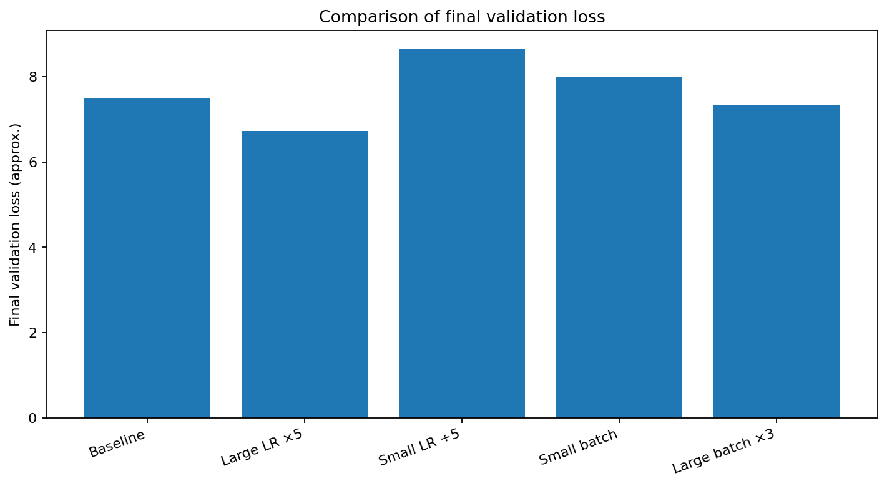
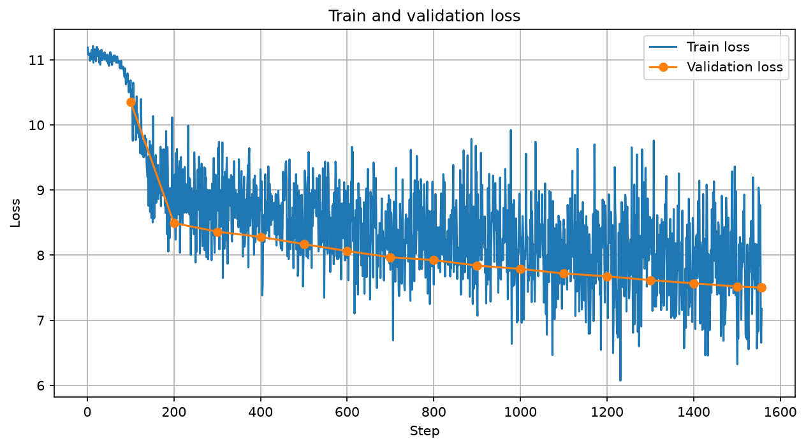
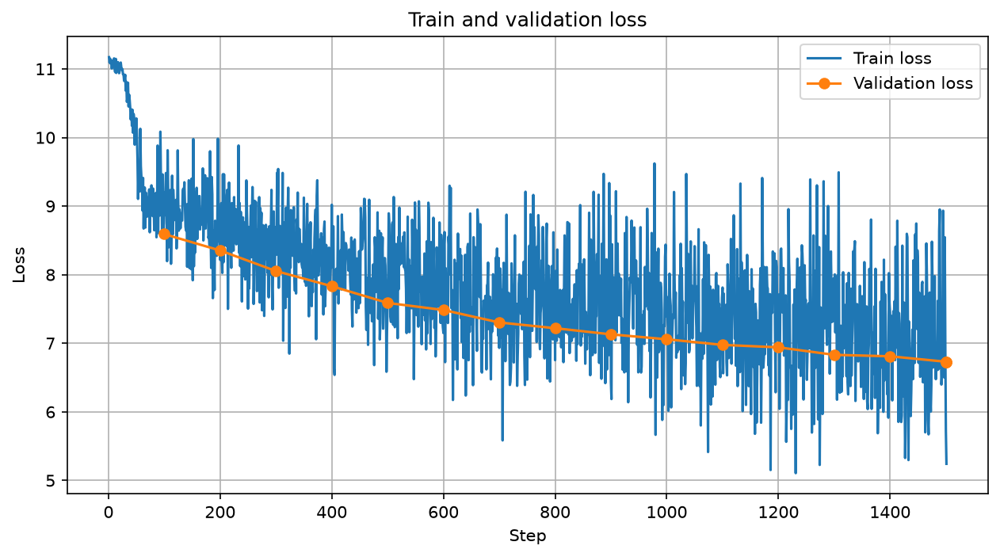
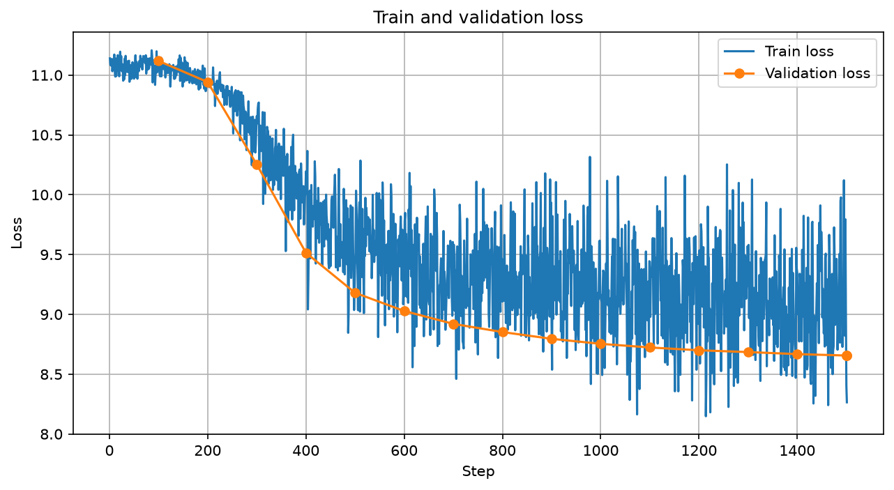
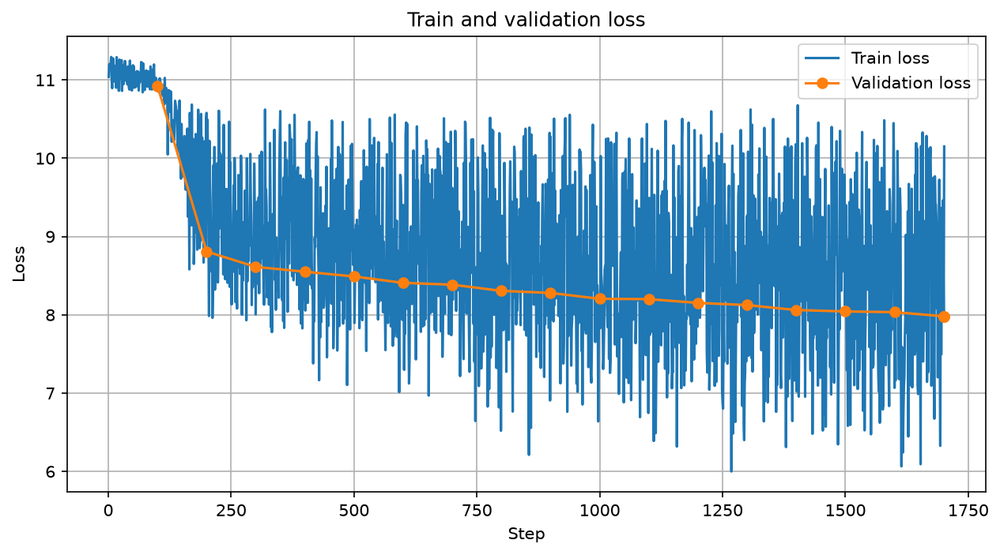
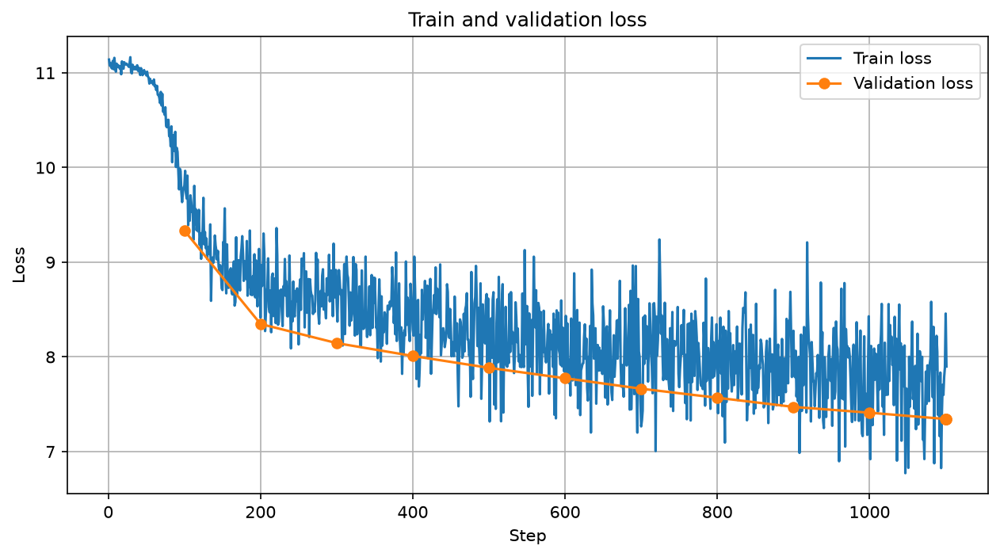

# Мини-претрейн Qwen3 ~1B на русской Wikipedia

## Цель

Цель работы — провести мини-претрейн языковой модели с нуля, сравнить несколько базовых гиперпараметров при фиксированном лимите времени и посмотреть, как меняются `loss` и качество первичных генераций.

Во всех экспериментах использовались одинаковые модель, датасет, токенизация и схема train/validation. Изменялись только `learning_rate` или `batch_size`. Каждый эксперимент обучался **15 минут**.

## Общий сетап

- Датасет: `wikimedia/wikipedia`, конфигурация `20231101.ru`
- Validation: первые 5000 объектов
- Tokenizer: `ai-forever/rugpt3small_based_on_gpt2`
- Максимальная длина: 512 токенов
- Модель: `Qwen3ForCausalLM`, около 960.9M параметров
- Инициализация модели: с нуля
- Optimizer: `adamw_torch_fused`
- `bf16=True`
- `tf32=True`
- `torch_compile=False`
- `gradient_accumulation_steps=1`
- Evaluation каждые 100 training steps
- Checkpoint'ы модели не сохранялись
- GPU: A100 80 GB
- Время обучения: 15 минут на эксперимент

## Эксперименты

| Эксперимент | Batch size | Learning rate | Примерное число шагов за 15 мин | Финальный validation loss |
|---|---:|---:|---:|---:|
| Baseline | 4 | 5e-5 | ~1560 | **~7.50** |
| Large LR ×5 | 4 | 2.5e-4 | ~1500 | **~6.73** |
| Small LR ÷5 | 4 | 1e-5 | ~1500 | **~8.65** |
| Small batch | 1 | 5e-5 | ~1700 | **~7.98** |
| Large batch ×3 | 12 | 5e-5 | ~1100 | **~7.34** |

## 1. Baseline

Параметры: `batch_size=4`, `learning_rate=5e-5`.

Loss быстро снижается примерно с 11 до диапазона 8–9, после чего продолжает более плавно уменьшаться. Последний validation loss находится примерно на уровне **7.5**.

Генерации уже приобретают характерную структуру русской Wikipedia: появляются заголовки «История», «Статус», упоминания населённых пунктов, годов и административных единиц. При этом текст остаётся плохо связным и содержит большое количество искажённых слов.

Пример полной генерации для промпта **«В начале XX века Россия»**:

> В начале XX века Россия () — село,  
> Дп-йру.  
>
> В 1943 года,  
>
> История  
> Статус  
> Описание в 2002 году.  
>
> Входит в семье-территори-йов, при которых в составе (3 метров), а также. В 2010 года, который был упраздн, к 1941 года в 2, который в США.  
>
> По состоянию  
> Статистика на чемпионате-йск, в 3 человека. В деревне 15 — 6-й

Модель уже выучила локальные шаблоны корпуса и пытается воспроизводить энциклопедическую структуру, но устойчивой семантики пока нет.

## 2. Learning rate ×5

Параметры: `batch_size=4`, `learning_rate=2.5e-4`.

Это лучший эксперимент по validation loss. Кривая существенно быстрее уходит вниз и заканчивается примерно на **6.7**. При одинаковом batch size и близком числе шагов этот эксперимент наиболее прямо показывает влияние learning rate.

Генерации выглядят более структурированными: появляются длинные фразы, секции «География», «История», «Население», а синтаксические шаблоны становятся более похожими на статьи Wikipedia. Семантически текст всё ещё часто бессмысленный, но локальная языковая структура заметно лучше, чем при слишком маленьком learning rate.

Пример полной генерации для промпта **«Москва — столица»**:

> Москва — столица собственное.  
> Кориновка — деревня в Уереском районе Ярославской области. Входит в состав Нов.ского сельского поселения.  
>
> География  
> Посёлок находится в юго-восточной части области, в лесостепной зоне, в пределах Вольевского района.  
>
> История  
> Находится в центральной части округа, примерно в центральной части района Московской области.  
>
> Население  
>
> Гендерный в 2010 году деревня относилась к селскому упразднения,

Вывод: в рамках короткого 15-минутного pretrain исходный `5e-5` оказался слишком консервативным, а `2.5e-4` позволил модели быстрее снижать loss и лучше усваивать локальные языковые шаблоны.

## 3. Learning rate ÷5

Параметры: `batch_size=4`, `learning_rate=1e-5`.

Это худший результат среди пяти запусков: финальный validation loss около **8.65**.

Различие особенно хорошо видно по генерациям. Модель часто выдаёт очень короткий осмысленный фрагмент, после чего переходит к большому количеству пустых строк и отдельных символов.

Пример полной генерации для промпта **«Москва — столица»**:

> Москва — столица дано.  
>
>
>
>
>
>
>
>
>
>
>
>
>
>
>
>
>
>
>
>
>
>
>
>
>
>
>
>
>
>
>
>
>
>
>
>
>
>
>
>
>
>
>
>
>
>
>
>
>
>
>
>
>
> (
>
>
>
>
>
>
>
>
>
>
>
>
>
>
>
>
> в

За 15 минут такой learning rate не позволяет модели достаточно далеко уйти от случайной инициализации.

Вывод: для короткого обучения `1e-5` слишком мал.

## 4. Очень маленький batch size

Параметры: `batch_size=1`, `learning_rate=5e-5`.

Validation loss заканчивается примерно на **7.98**. Train loss заметно более шумный, что ожидаемо при маленьком batch size: оценка градиента имеет значительно большую дисперсию.

Генерации напоминают baseline: модель воспроизводит структуру энциклопедической статьи, но текст нестабилен и содержит много искажённых слов и повторов.

Пример полной генерации для промпта **«Искусственный интеллект — это»**:

> Искусственный интеллект — это в городском-Дское.  
>
> История  
> В 2002 году составляло км на сайте на расстоянии и «Зас».  
>
> География  
> Селоок в среднемги, в пределах году, а в селе-Лю сельсовета.  
>
> После по футболу на острове в честь-территори и 18.  
>
> Примечания  
>
> Ссылки  
> Официальный сайт года по футболу — 14 на расстоянии года.  
>
> Ссылки  
>
> Населённые пункты Иные в состав

При фиксированных 15 минутах batch size влияет не только на свойства оптимизации, но и на количество данных, которое модель успевает обработать. Несмотря на большее число optimizer steps, `batch_size=1` на каждом шаге видит существенно меньше примеров, чем baseline.

## 5. Batch size ×3

Параметры: `batch_size=12`, `learning_rate=5e-5`.

Этот эксперимент дал второй лучший validation loss — около **7.34**, несмотря на меньшее число optimizer steps.

Кривая train loss заметно менее шумная, чем при `batch_size=1`. Генерации имеют узнаваемую энциклопедическую структуру и выглядят более цельными, хотя содержательно модель всё ещё часто ошибается.

Пример полной генерации для промпта **«В начале XX века Россия»**:

> В начале XX века Россия () — село в России, в регионе в составе района в экономиском районе, в составе района.  
>
> Население  
> Деревня находится в северо-запад от центра города — 2 км, на правом берегу реки (по прямой) к юго-западу от города, в зоне части Российской Федерации.  
>
> Население  
>
> Примечания  
>
> Населённые пункты  
> Населённые пункты — село в деревне района (показа)  
>
> Населённые пункты

При фиксированном времени большой batch позволяет обрабатывать больше обучающих примеров за один optimizer step, поэтому результат отражает одновременно и эффект размера batch, и различие в количестве просмотренных токенов.

## Сравнение и выводы

1. **Лучший результат показал learning rate `2.5e-4`**: validation loss около 6.73. Для короткого обучения модели с нуля более высокий learning rate оказался полезен.
2. **Слишком маленький learning rate `1e-5` явно недостаточен**: loss снижается медленно, а генерации практически не формируются.
3. **Большой batch size 12 оказался лучше baseline по validation loss**, вероятно благодаря более стабильной оценке градиента и большему объёму данных, обработанному за фиксированные 15 минут.
4. **Batch size 1 даёт более шумный train loss** и уступает baseline по validation loss.
5. Уже через 15 минут модель начинает воспроизводить локальную структуру русского Wikipedia-текста: заголовки, секции, шаблоны описания населённых пунктов и энциклопедический стиль.
6. При этом генерации ещё далеки от полностью осмысленных: присутствуют вымышленные слова, логические ошибки, повторы и смешение шаблонов. Это ожидаемо для ~1B модели, обучаемой с нуля всего 15 минут.
7. Поскольку perplexity равна `exp(loss)`, снижение validation loss означает и снижение perplexity. Лучший эксперимент `large_lr` соответственно имеет минимальную perplexity среди исследованных конфигураций.

## Общие выводы

Источник данных очень важен - при генерации фактически копировался формат википедийность страницы ("примечания", "ссылки" и тп).
При жёстком ограничении по времени скорость обучения становится особенно важной, поэтому слишком маленький learning rate не успевает дать хороший результат.   
Размер batch также сильно влияет на результат, поскольку меняет не только шум градиента, но и фактический объём данных, который модель успевает обработать за 15 минут (и благодаря тому, что GPU достаточно мощный, можно было бы внести ещё больше данных).

## Файлы с полными генерациями

Полные примеры генерации для каждого запуска приложены отдельно:

- `generations/baseline_generations.txt`
- `generations/large_lr_generations.txt`
- `generations/small_lr_generations.txt`
- `generations/small_batch_generations.txt`
- `generations/large_batch_generations.txt`
